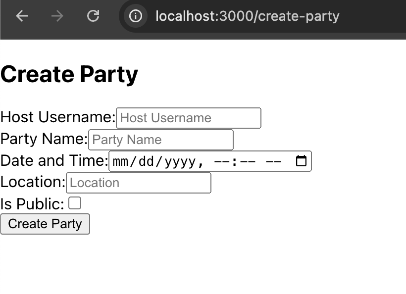
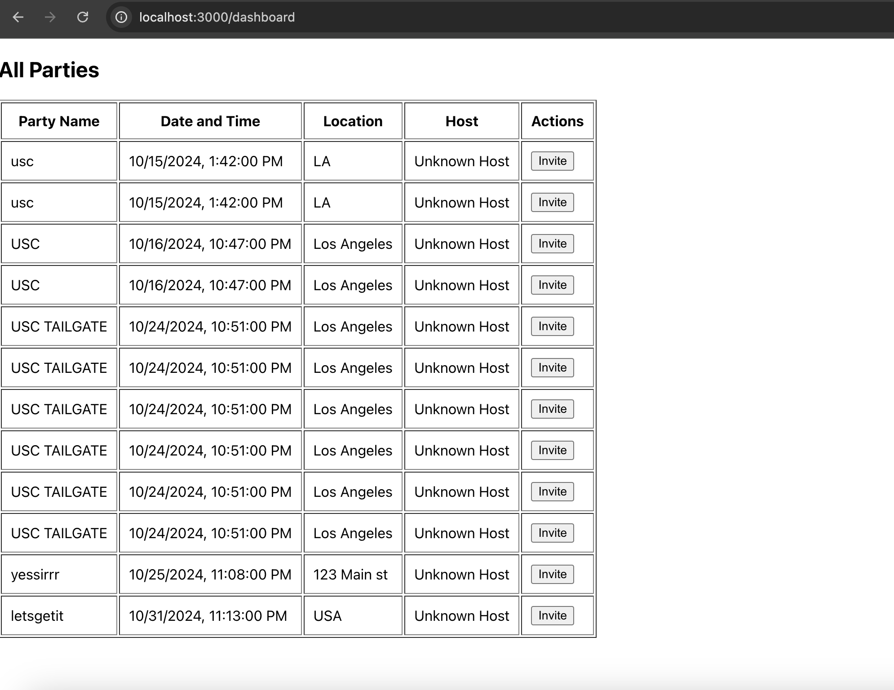

# Party Invitation System

A web-based application that allows users to create parties, send invitations via email, and manage RSVPs. This project is built using Spring Boot for the backend and React.js for the frontend.


## Features

- User registration and login.
- Create public or private parties.



- Send email invitations to guests.
- View all created parties on a dashboard.



## Technologies Used

- **Backend:** Java, Spring Boot
- **Frontend:** React.js, JavaScript, HTML, CSS
- **Database:** PostgreSQL
- **Deployment:** Git

## Prerequisites

Before you begin, ensure you have met the following requirements:

- Java 11 or above
- Node.js 14.x or above
- PostgreSQL
- Git

## Installation

### Backend Setup (Spring Boot)

1. Clone the repository:
    ```bash
    git clone https://github.com/yourusername/party-invitation-system.git
    ```

2. Navigate to the backend directory:
    ```bash
    cd backend
    ```

3. Configure PostgreSQL:
   - Set up a PostgreSQL database.
   - Update your `application.properties` file with your database credentials.

4. Build the project:
    ```bash
    ./mvnw clean install
    ```

5. Run the backend server:
    ```bash
    ./mvnw spring-boot:run
    ```

The backend should now be running on `http://localhost:8080`.

### Frontend Setup (React.js)

1. Navigate to the frontend directory:
    ```bash
    cd frontend/party-invitation-frontend
    ```

2. Install the dependencies:
    ```bash
    npm install
    ```

3. Run the frontend server:
    ```bash
    npm start
    ```

The frontend should now be running on `http://localhost:3000`.

## API Endpoints

### Auth Endpoints

- **POST** `/api/auth/register` - Register a new user
- **POST** `/api/auth/login` - Login for existing users

### Party Endpoints

- **POST** `/api/parties` - Create a new party
- **GET** `/api/parties` - Get all parties
- **GET** `/api/parties/{id}` - Get a party by ID
- **PUT** `/api/parties/{id}` - Update a party
- **DELETE** `/api/parties/{id}` - Delete a party

### Invitation Endpoints

- **POST** `/api/invitations/{partyId}` - Invite a guest to a party

## Running with Docker (Optional)

1. Build the Docker images:
    ```bash
    docker-compose build
    ```

2. Start the services:
    ```bash
    docker-compose up
    ```

## Contributing

To contribute to this project:

1. Fork the repository.
2. Create a new branch (`git checkout -b feature/your-feature`).
3. Make your changes and commit them (`git commit -m 'Add some feature'`).
4. Push to the branch (`git push origin feature/your-feature`).
5. Open a pull request.

## License

This project is open source and available under the [MIT License](LICENSE).
